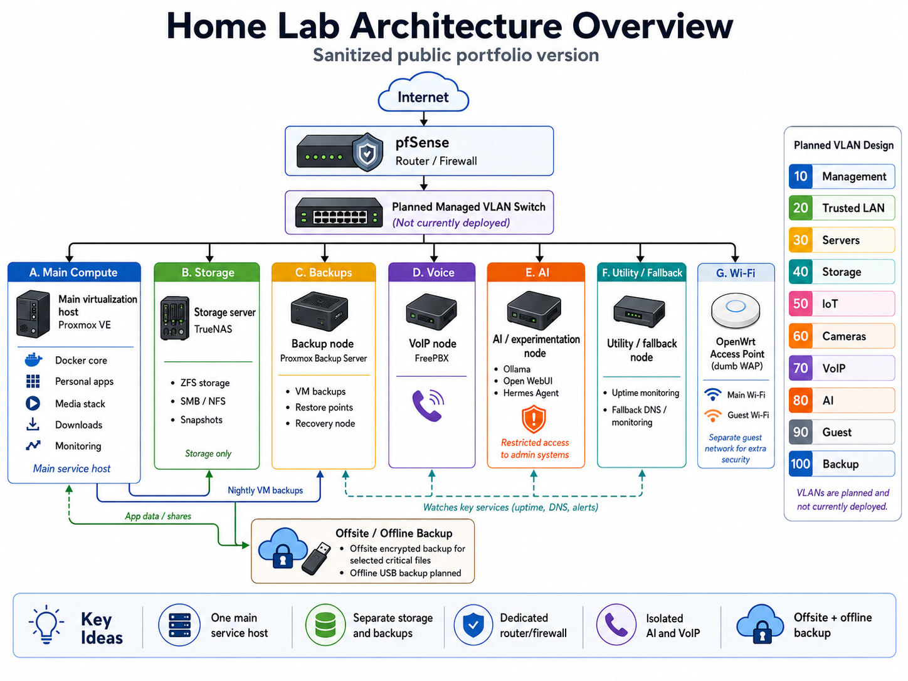

# Linux Self-Hosted Infrastructure Lab

Practical self-hosted infrastructure lab focused on Linux administration, networking, virtualization, Docker-based services, firewalls, DNS, VPN access, reverse proxies, backups, monitoring, and troubleshooting.

This repository documents a private, self-managed infrastructure environment that I use to build hands-on skills relevant to IT support, Linux system administration, networking, infrastructure operations, and self-hosted service management.

> **Security note:** This repository intentionally omits or redacts sensitive details such as public IP addresses, real domains, credentials, private keys, internal addressing, exact firewall rules, secrets, and production configuration values.

---

## Summary

This lab is built around practical infrastructure work, not just running applications. I use it to practice installing, maintaining, documenting, and troubleshooting Linux-based services in a realistic home and small-business-style environment.

The current lab includes Linux servers, Proxmox virtualization, TrueNAS storage, Proxmox Backup Server, Docker Compose services, Cloudflare DNS, Tailscale VPN-style access, monitoring, VoIP, local AI experimentation, and pfSense as the central edge platform. pfSense currently handles firewalling, pfBlockerNG DNS/IP filtering, Suricata IDS/IPS visibility, ACME/TLS certificate management, and HAProxy reverse proxy routing.

Some components are implemented, some were previously tested, and others are planned or being improved. The goal of this repository is to show practical learning, structured troubleshooting, security awareness, and documentation habits without publishing sensitive configuration details.

---

## What This Demonstrates

This project demonstrates practical experience with:

- Installing and maintaining Linux server environments
- Running self-hosted services with Docker Compose
- Managing reverse proxy access with HAProxy
- Managing DNS and ACME/TLS certificate workflows
- Using VPN tools for secure remote access
- Operating pfSense-based firewalling, DNS/IP filtering with pfBlockerNG, Suricata visibility, ACME certificate workflows, and HAProxy reverse proxy routing
- Working with Proxmox VE, Proxmox Backup Server, and TrueNAS
- Troubleshooting Linux services, containers, DNS, firewall, and connectivity issues
- Planning backups and recovery workflows
- Documenting infrastructure decisions clearly

---

## Repository Status

This repository is a portfolio and documentation project.

| Status | Meaning |
|---|---|
| Implemented | Currently running or previously built/tested in my lab |
| In progress | Being configured, documented, or improved |
| Planned | Studied or planned, but not yet fully implemented |
| Omitted | Not included in this repository or not relevant to this version |

---

## High-Level Architecture

The lab is organized around separate infrastructure roles: routing/firewalling, virtualization, storage, backups, application services, monitoring, VoIP, and experimentation.

The diagram above is a sanitized public overview. It avoids real domains, IP addresses, credentials, exact firewall rules, and sensitive internal details.

<pre>
Internet
   |
   v
Firewall / Router
(pfSense)
   |
   +-- OpenWrt access point
   |     - Main Wi-Fi
   |     - Separate guest Wi-Fi
   |
   v
Home / lab network
   |
   v
Planned managed VLAN switch
(not currently deployed)
   |
   +-- Virtualization host
   |     - Linux VMs
   |     - Docker services
   |     - Monitoring services
   |
   +-- Storage server
   |     - File storage
   |     - Snapshots
   |     - Backup targets
   |
   +-- Backup server
   |     - VM/container backups
   |     - Restore points
   |
   +-- VoIP server
   |
   +-- AI / experimentation node
   |
   +-- Lightweight nodes
         - DNS filtering / fallback services
         - Sensors / testing
</pre>

---

## Documentation

This repository includes sanitized documentation that shows troubleshooting logic and operational habits without exposing real domains, IP addresses, credentials, private keys, internal addressing, or firewall rules.

### Case Studies

- [Service unreachable troubleshooting flow](./docs/case-studies/service-unreachable-troubleshooting.md)

### Runbooks

- [Linux service troubleshooting checklist](./docs/runbooks/linux-service-troubleshooting-checklist.md)

---

## Infrastructure Components and Platforms

This section lists the infrastructure building blocks: platforms, network/security components, deployment tooling, storage, backup, and edge services. Application workloads are listed separately below. The table is ordered roughly from the network edge and access layer through virtualization, storage, deployment tooling, and planned decoupling experiments.

| Component | Status | Purpose | Notes |
|---|---|---|---|
| pfSense | Implemented | Edge firewall/router and security platform | Central platform for firewalling, routing, pfBlockerNG, Suricata, ACME certificates, and HAProxy reverse proxying |
| pfBlockerNG | Implemented | DNS/IP filtering | Managed through pfSense for DNS filtering and IP block lists |
| Suricata | Implemented | IDS/IPS visibility | Managed through pfSense for traffic alerts and security monitoring |
| HAProxy | Implemented | Reverse proxy | Managed through the pfSense HAProxy package; future improvement is evaluating a dedicated reverse proxy outside pfSense |
| ACME / Let's Encrypt | Implemented | TLS certificates | Managed through the pfSense ACME package; future improvement is evaluating a dedicated ACME workflow outside pfSense |
| OpenWrt | Implemented | Wireless access point role | Used as a dumb WAP with main Wi-Fi and separate guest Wi-Fi |
| Cloudflare DNS | Implemented | DNS and domain management | Used for DNS/domain routing |
| Tailscale | Implemented | VPN-style remote access | Used because the current connection is behind CGNAT |
| WireGuard | Previously implemented | VPN access | Used in the past; currently less central because of CGNAT |
| Proxmox VE | Implemented | Virtualization platform | Used for virtualized services and lab systems |
| TrueNAS | Implemented | Storage platform | Used for storage and snapshots |
| Proxmox Backup Server | Implemented | Backup and restore platform | Used for VM/container backup workflows |
| Docker | Implemented | Container runtime | Used for self-hosted services |
| Docker Compose | Implemented | Service deployment | Used to define and operate multi-container services |
| Pi-hole | Previously implemented / planned again | DNS filtering | Planned as a possible dedicated DNS filtering layer outside pfSense |
| Traefik | Planned | Reverse proxy exploration | Planned for comparison and for evaluating reverse proxy / certificate management outside pfSense |
| Headscale | Planned | Self-hosted Tailscale control server | Planned for future experimentation |

---

## Self-Hosted Applications and Workloads

This section lists the applications and service-like workloads that run on top of the infrastructure components above. The table is grouped by purpose: productivity/data, web/information services, monitoring, media, communication, AI/automation experimentation, and planned applications.

| Workload | Status | Purpose |
|---|---|---|
| Nextcloud | Implemented | File access and collaboration |
| Syncthing | Implemented | File synchronization |
| Vaultwarden | Implemented | Password manager service |
| Joplin | Implemented | Notes / documentation workflow |
| WordPress | Implemented | Web hosting practice |
| SearXNG | Implemented | Self-hosted search |
| Uptime Kuma | Implemented | Uptime and availability monitoring |
| Grafana | Implemented | Monitoring dashboards and metrics visualization |
| Prometheus | Implemented | Metrics collection |
| Jellyfin | Implemented | Media service |
| Jellyseerr | Implemented | Media request workflow |
| Navidrome | Implemented | Music streaming |
| Audiobookshelf | Implemented | Audiobook management |
| Calibre-Web | Implemented | E-book library |
| Sonarr | Implemented | Media automation |
| Radarr | Implemented | Media automation |
| Prowlarr | Implemented | Indexer management |
| MeTube | Implemented | Media download workflow |
| FreePBX | Implemented | VoIP server and telephony experimentation |
| Ollama | Implemented | Local AI experimentation |
| Open WebUI | Implemented | Local AI web interface for Ollama |
| OpenClaw | Previously implemented | Agentic AI experimentation |
| Hermes Agent | Implemented | Local agentic automation experimentation |
| Immich | Planned | Photo management |
| Home Assistant | Planned | Smart home automation |

---

## Network Design

The current network uses pfSense and OpenWrt-based components. OpenWrt provides wireless access point functionality, while pfSense handles firewall/router duties.

In this setup, pfSense also manages several edge and security services through packages: pfBlockerNG for DNS/IP filtering, Suricata for IDS/IPS visibility, ACME for Let's Encrypt certificate workflows, and HAProxy for reverse proxy routing.

As a future improvement, I want to reduce how many supporting services are tightly coupled to pfSense. The goal is to keep pfSense focused on routing, firewalling, and edge security, while moving some service-level functions to dedicated hosts or VMs where appropriate. This includes evaluating Pi-hole for DNS filtering and evaluating a dedicated reverse proxy / certificate workflow, for example with Traefik or a Linux-hosted HAProxy and ACME setup.

VLAN-based segmentation is planned for the next stage after adding a managed switch. The planned design separates different types of systems into logical zones instead of treating the whole network as one flat environment.

Planned or designed network zones:

| Zone | Purpose | Status |
|---|---|---|
| Management | Infrastructure administration interfaces | Planned |
| Trusted LAN | Personal trusted devices | Planned |
| Servers | Self-hosted application services | Planned |
| Storage | NAS/storage and backup traffic | Planned |
| IoT | Less trusted smart devices | Planned |
| Cameras | Camera/security devices | Planned |
| VoIP | FreePBX and phone-related traffic | Planned |
| AI / Experimental | AI and lab/testing workloads | Planned |
| Guest | Guest access | Planned |
| Backup | Backup and recovery traffic | Planned |

The intended design follows a least-privilege mindset: administrative interfaces should not be exposed publicly, and access between zones should only be allowed where needed.

Example allowed traffic patterns, expressed generically:

- Admin workstation to infrastructure management interfaces
- Virtualization host to storage/backup services
- VPN clients to selected internal services
- Monitoring system to service health endpoints
- VoIP devices to the VoIP server

Exact firewall rules, internal addresses, and real network details are intentionally not published.

To avoid VPN routing conflicts, the home network was moved away from very common private ranges such as `192.168.1.0/24` to a less common private subnet. The exact subnet is intentionally not published.

### Wi-Fi and Guest Network

Wireless access is provided through an OpenWrt router configured as a dumb wireless access point.

The access point provides:

- Main Wi-Fi for trusted devices
- Separate guest Wi-Fi for visitors
- Guest access intended to reduce exposure of trusted devices and internal services
- Central routing/firewall handling through pfSense

The guest Wi-Fi is documented at a high level only. Real SSIDs, passwords, MAC addresses, internal addressing, and exact access rules are intentionally not published.

### Client and Endpoint Devices

The lab also includes different types of client and endpoint devices, because troubleshooting and network design are not only server-side tasks.

Endpoint types include:

| Endpoint Type | Purpose | Notes |
|---|---|---|
| Desktop workstation | Main administration and daily-use system | Used for SSH access, documentation, Git workflows, testing, and service administration |
| Laptop | Mobile client and secondary admin device | Used for testing access from another client and working from different network locations |
| Smartphone | Mobile access and user-device testing | Useful for checking VPN access, mobile web access, notifications, and real user behavior |
| Remote access clients | Remote laptop or smartphone access | Connect back to selected internal services through VPN-style access, currently mainly Tailscale because of CGNAT |
| IoT / smart devices | Less trusted endpoint category | Intended to be separated more clearly with future VLAN-based segmentation |
| Guest devices | Visitor access | Intended to stay separated from trusted devices and internal services |
| VoIP clients / phones | Telephony endpoint category | Related to FreePBX and planned VoIP network separation |

Remote access devices such as a laptop or smartphone can connect back to selected internal services through VPN-style access. In the current setup, Tailscale is used for this because the internet connection is behind CGNAT, while WireGuard was previously tested. These devices are treated differently from local trusted LAN clients because they may connect from external or less trusted networks.

The goal is to treat different endpoint types according to their trust level. Administrative systems, trusted personal devices, guest clients, IoT devices, and VoIP devices should not all have the same level of access to internal services.

At the moment, this is documented at a high level only. Real device names, MAC addresses, SSIDs, user information, internal addresses, and exact access rules are intentionally not published.

---

## Main Technologies

### Linux and Platforms

- Debian
- Ubuntu Server
- Proxmox VE
- Proxmox Backup Server
- TrueNAS
- Raspberry Pi OS

### Networking and Security

- pfSense as the edge firewall/router platform
- pfSense packages: pfBlockerNG, Suricata, ACME, and HAProxy
- OpenWrt
- DHCP
- DNS
- pfBlockerNG
- Tailscale
- WireGuard
- Firewall policy design
- SSH hardening
- TLS certificates
- Cloudflare DNS
- ACME / Let's Encrypt
- HAProxy
- Suricata
- Basic security lab practice with Kali Linux, nmap, Wireshark, and network/service exposure checks

### Containers and Services

- Docker
- Docker Compose
- Uptime Kuma
- Grafana
- Prometheus
- Nextcloud
- Syncthing
- Vaultwarden
- Joplin
- Jellyfin
- SearXNG
- Ollama
- Open WebUI
- FreePBX

### Administration and Troubleshooting Tools

- systemd
- journalctl
- cron
- SSH key-based administration / scp / rsync
- Bash scripting
- ping
- dig
- nslookup
- traceroute
- nmap
- tcpdump
- Wireshark

---

## What I Built

- Installed and maintained Linux server environments
- Deployed self-hosted applications using Docker Compose
- Configured reverse proxy access for multiple services using the pfSense HAProxy package
- Managed DNS records and domain routing through Cloudflare
- Managed TLS certificates using the pfSense ACME package / Let's Encrypt workflows
- Configured VPN-style remote access using Tailscale and previously WireGuard
- Configured routing, DHCP/DNS, DNS/IP filtering with pfBlockerNG, Suricata visibility, firewall concepts, and service access rules with pfSense
- Used OpenWrt as a wireless access point
- Built and operated storage workflows with TrueNAS and snapshots
- Used Proxmox VE for virtualization and Proxmox Backup Server for backup workflows
- Used Uptime Kuma, Grafana, and Prometheus for monitoring and visibility
- Used logs, service status checks, and network tools to troubleshoot problems
- Created simple Bash scripts for maintenance tasks
- Documented service roles, architecture decisions, and recovery planning

---

## Backup and Recovery Strategy

The backup design separates service recovery, file recovery, configuration recovery, and disaster recovery.

| Backup Layer | Purpose | Status |
|---|---|---|
| Proxmox Backup Server | VM/container backup and restore workflows | Implemented |
| TrueNAS snapshots | Local rollback for storage datasets | Implemented |
| Exported configuration backups | Recovery of pfSense, TrueNAS, Docker, and application configurations | Implemented |
| Offsite encrypted backups | Protection for important small files and configuration data | Implemented for selected critical data |
| Offline backup media | Protection against ransomware or accidental deletion | Planned |
| Restore testing | Verification that backups can actually be restored | Planned |

### Data Priority

| Data Type | Backup Priority |
|---|---|
| Password vault, documents, photos, configuration files | Critical |
| Service databases and application configs | High |
| Media metadata and application state | Medium |
| Download cache, transcodes, temporary files | Low / disposable |

The long-term goal is not only to create backups, but to test restores and document recovery steps.

---

## Security Practices

Security is treated as a core design goal in this self-managed lab.

Implemented practices include:

- VPN-first access model for internal and administrative services
- No public exposure of firewall, NAS, hypervisor, or backup administration interfaces
- SSH key-based administration for server access where appropriate
- Password-based SSH login disabled or reduced on managed Linux hosts, with continued hardening in progress
- TLS certificates for web services
- DNS/IP filtering with pfBlockerNG managed in pfSense
- Password manager usage
- Suricata IDS/IPS visibility through pfSense
- Regular review of exposed ports and service access
- Sensitive values excluded from public documentation

Planned or improving practices:

- Stronger segmentation with VLANs after adding managed switch hardware
- More systematic firewall zone documentation
- Offline backup media
- Formalized backup restore testing
- More sanitized configuration examples
- Reducing service coupling by evaluating Pi-hole for DNS filtering and a dedicated reverse proxy / ACME workflow outside pfSense

---

## Monitoring and Troubleshooting

Monitoring and troubleshooting are handled with service checks, logs, dashboards, and network tools.

Typical checks include:

- Firewall/router reachability
- Proxmox host reachability
- TrueNAS availability
- DNS health
- Internet connectivity
- Backup server availability
- Service uptime
- Reverse proxy status
- TLS certificate status
- VoIP service availability

Typical troubleshooting commands:

<pre>
systemctl status &lt;service&gt;
journalctl -u &lt;service&gt;
docker ps
docker compose logs
dig example.com
ping 1.1.1.1
traceroute example.com
nmap -sV &lt;host&gt;
tcpdump -i &lt;interface&gt;
</pre>

### Troubleshooting Examples

These examples are generalized and sanitized.

#### DNS filtering / resolution issue

When DNS filtering or name resolution does not behave as expected, I check the client DNS settings, pfSense/pfBlockerNG configuration, upstream resolver behavior, and command-line output from tools such as `dig` and `nslookup`. This helps separate client-side issues from firewall/DNS resolver issues.

#### Reverse proxy or TLS issue

When a self-hosted service is not reachable through its domain, I check DNS records, Cloudflare settings, HAProxy frontend/backend routing, certificate status, service availability, and firewall exposure. This makes it possible to identify whether the failure is caused by DNS, TLS, reverse proxy configuration, or the backend service itself.

#### Docker service failure

When a containerized service fails or becomes unavailable, I check `docker ps`, `docker compose logs`, exposed ports, volumes, environment configuration, restart policies, and the underlying host resources. I also verify whether the service itself is failing or whether the reverse proxy or network path is the actual problem.

#### VPN / CGNAT access change

After moving behind CGNAT, direct inbound access became less practical. I adapted the remote-access approach by using Tailscale for VPN-style access to internal services instead of relying only on direct port forwarding.

#### Backup and restore planning

For important services and configuration data, I separate VM/container backups, storage snapshots, exported configuration backups, and selected offsite encrypted backups. The next improvement is formal restore testing and documented recovery steps.

---

## Documentation Practices

This repository is intended to document infrastructure decisions in a clear and professional way.

Documentation included or planned:

- Architecture overview
- Network segmentation plan
- Service placement table
- Backup strategy
- Recovery checklist
- Sanitized Docker Compose examples
- Sanitized reverse proxy examples
- Troubleshooting notes
- Change log for major infrastructure changes

Planned documentation files:

<pre>
docs/
  architecture.md
  services.md
  backup-strategy.md
  troubleshooting.md
  security.md
</pre>

---

## Sanitized Examples

This repository may include sanitized examples of configuration patterns, but not live production configuration.

Planned examples:

<pre>
examples/
  docker-compose-redacted.yml
  reverse-proxy-redacted.cfg
  backup-checklist.md
</pre>

All examples should remove or replace:

- real domains
- credentials
- tokens
- public IP addresses
- private keys
- exact internal addresses
- exact production firewall rules
- unredacted `.env` files

---

## What I Learned

This project helped me build practical experience in:

- Linux server administration
- Virtualization with Proxmox
- Docker Compose service deployment
- Reverse proxy and TLS management
- DNS, DHCP, VPN, firewall, and routing concepts
- Storage and backup planning with TrueNAS and Proxmox Backup Server
- Monitoring and uptime checks
- Security-aware self-hosting
- Technical documentation
- Troubleshooting services systematically
- Explaining technical infrastructure to non-technical users

Concrete lessons:

- Troubleshooting is easier when checking one layer at a time: DNS, firewall, reverse proxy, backend service, logs, and host resources.
- Backups are only useful if recovery is planned and tested.
- Publicly exposing admin interfaces is not worth the risk; VPN-first access is safer for internal services.
- Documentation helps avoid repeating the same investigation when an issue comes back later.
- Separating implemented, planned, and experimental components prevents overclaiming and makes the project easier to explain.

---

## Current Focus

- Preparing for LPIC-1
- Improving infrastructure documentation
- Expanding backup and restore testing
- Publishing sanitized configuration examples
- Improving monitoring and alerting
- Hardening public-facing services
- Planning VLAN-based segmentation with managed switch hardware
- Reducing pfSense service coupling by evaluating Pi-hole for DNS filtering and a dedicated reverse proxy / ACME workflow outside pfSense
- Building a clean portfolio of practical Linux and networking projects

---

## Repository Disclaimer

This repository documents a private learning and infrastructure environment.

It does not contain:

- real secrets
- private keys
- credentials
- public IP addresses
- real domains
- exact internal addressing
- exact production firewall rules
- sensitive domain configuration
- unredacted `.env` files

The purpose is to demonstrate practical IT infrastructure skills, structured thinking, troubleshooting, and hands-on learning through a real self-managed environment.
