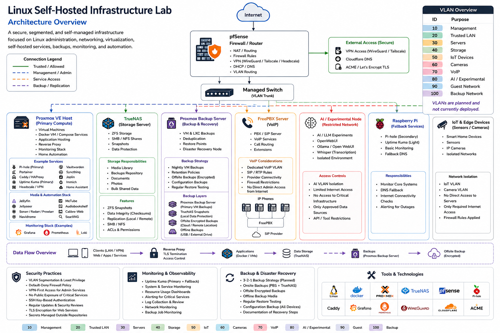

# Architecture

- **Status:** Active architecture reference / implementation in progress.
- **Scope:** Compute, storage, Docker Compose workloads, backups, monitoring, media storage, and operational design.
- **Security note:** This document intentionally avoids real IP addresses, internal hostnames, domains, credentials, subnet details, secrets, exact firewall rules, and production configuration values.---

## Purpose

This document is the canonical architecture reference for the self-hosted infrastructure lab.

The README gives the public overview. This file explains how the main infrastructure pieces fit together, why responsibilities are separated across platforms, where service data lives, which alternatives were considered, and what is documented during implementation.

The goal is a reliable and understandable infrastructure design that can be rebuilt, troubleshot, and expanded while keeping operational complexity under control.

---

## Design Goals

The architecture is designed around these priorities:

- Reliability and recoverability over maximum performance.
- Clear separation between compute, storage, networking, and backup roles.
- Simple operational model that is easy to explain and rebuild.
- Local SSD storage for live application state.
- TrueNAS storage for bulk files, media, shares, snapshots, and backup targets.
- Docker Compose inside a normal Linux VM, not directly on the Proxmox host.
- Existing network capacity is used as the baseline, with upgrades considered only when monitoring shows a real bottleneck.
- Sanitized public documentation that avoids sensitive operational details.

---

## High-Level Architecture

The infrastructure is organized around separate roles for routing, wireless access, compute, storage, backups, VoIP, AI experimentation, monitoring, and fallback services.



The diagram above is a sanitized public overview of the lab architecture. It shows the main infrastructure roles, service placement, storage responsibilities, backup flow, and planned network segmentation model.

```text
                                  Internet
                                     |
                                     v
                            Firewall / Router
                          (pfSense / edge layer)
                                     |
          +--------------------------+--------------------------+
          |                          |                          |
          v                          v                          v
   OpenWrt access point       VPN-style remote access     Public DNS / TLS
   Main Wi-Fi                 Tailscale / remote clients  Cloudflare / ACME
   Guest Wi-Fi
          |                          |                          |
          +--------------------------+--------------------------+
                                     |
                                     v
                       Internal infrastructure network
                                     |
                       Planned managed switching / VLANs
                         introduced as rollout requires
                                     |
          +--------------------------+--------------------------+
          |                          |                          |
          v                          v                          v
   Proxmox VE node             TrueNAS node              Backup node
   Compute / VMs               NAS / storage             Critical backups
   Docker VM                   ZFS datasets              Restore points
   Home Assistant VM           NFS / SMB shares          Config/data copies
   Monitoring / test VMs
          |
          v
   Containerized application services
   Nextcloud, Syncthing, Vaultwarden, Joplin, WordPress,
   SearXNG, Uptime Kuma, Grafana, Prometheus, Jellyfin,
   Jellyseerr, Navidrome, Audiobookshelf, Calibre-Web,
   Immich, and related Docker Compose workloads

          +--------------------------+--------------------------+
          |                          |                          |
          v                          v                          v
   Dedicated VoIP server       AI / experimentation       Lightweight nodes
   FreePBX                     role / node                DNS fallback, sensors,
                               Ollama, Open WebUI,        testing, and support
                               OpenClaw, Hermes Agent     services
```

---

## Final Architecture Decision

The lab uses a separated infrastructure-role design rather than placing every function on one system.

- **Proxmox VE node:** runs virtual machines, the Docker application VM, monitoring workloads, test systems, and the planned Home Assistant VM.
- **Docker VM:** runs the main Docker Compose application stack and keeps container runtime state off the Proxmox host OS.
- **TrueNAS node:** acts as the dedicated NAS with ZFS datasets shared over NFS/SMB.
- **Backup node:** stores important backups, VM data, configs, databases, restore points, and irreplaceable files.
- **OpenWrt access point:** provides main and guest Wi-Fi while pfSense remains the central routing and firewall layer.
- **Dedicated VoIP server:** runs FreePBX and keeps telephony services separate from the main Docker stack.
- **AI / experimentation role:** hosts AI and automation workloads separately from core storage and routing responsibilities.

This keeps the design simple in the right places:

- Proxmox handles virtualization and general compute workloads.
- TrueNAS handles storage, snapshots, and NAS shares.
- OpenWrt handles wireless access point duties without taking over core routing.
- Docker runs inside a regular Linux VM.
- FreePBX is documented as a dedicated VoIP server role, not as part of the Docker VM.
- Home Assistant is planned as its own VM.
- The NAS is not used as the main application platform.
- The Proxmox node is not used as the long-term bulk storage system.

Operating pattern:

- Run Docker inside a Ubuntu VM on Proxmox.
- Keep databases, application configs, indexes, metadata, thumbnails, logs, monitoring data, and container runtime state on local SSD-backed storage.
- Keep large bulk data on TrueNAS: media, music, audiobooks, ebooks, photo/video originals, shared files, and backup datasets.
- Mount TrueNAS datasets into the Docker VM over NFS for Linux workloads that need access to bulk files.
- Keep FreePBX backups and exported configuration data in the backup plan, even though the service runs outside the Docker VM.
- Start with the existing network and upgrade only if monitoring shows sustained network saturation.

---

## Platform Responsibilities

| Platform / Role | Purpose | Responsibilities | Out of Scope |
|---|---|---|---|
| pfSense / edge layer | Routing, firewalling, reverse proxy, certificates, DNS filtering visibility | Edge routing, firewall policy, HAProxy, ACME, pfBlockerNG, Suricata visibility | Becoming the place where unrelated application logic accumulates |
| Proxmox VE | Compute and virtualization | Linux VMs, the Docker VM, planned Home Assistant VM, VM backups, resource allocation, isolated test systems | Running Docker directly on the hypervisor OS |
| OpenWrt access point | Wireless access | Main Wi-Fi, guest Wi-Fi, wireless client access | Acting as an unintended second router or NAT layer |
| Docker VM | Main container runtime | Docker Compose stacks, app networks, bind mounts, container volumes, application service runtime | Holding large media or NAS-scale data on the VM disk |
| TrueNAS | Storage and snapshots | ZFS pools, datasets, NFS/SMB shares, snapshots, disk health | Acting as the primary application platform |
| Backup node | Recovery target | Critical backups, restore testing, config/database copies | Being described as a full backup target for data it cannot actually store |
| Dedicated VoIP server | Telephony | FreePBX, VoIP service state, phone-related service availability | Being grouped into the Docker VM or treated as an optional Proxmox workload |
| AI / experimentation role | AI and automation testing | Ollama, Open WebUI, OpenClaw, Hermes Agent, and related experiments where resources allow | Sharing failure domains with storage or routing responsibilities unnecessarily |

---

## Compute Architecture

### Proxmox VE Node

The Proxmox node is the main virtualization layer. It hosts the Docker VM, Linux service VMs, monitoring workloads, test systems, and the planned Home Assistant VM.

The expected constraints are memory, local SSD capacity, and storage growth from service state. CPU usage is validated with monitoring before changes are made. Hardware models and exact specifications are intentionally not published in this document.

Operational expectations:

- Keep enough memory headroom for the Docker VM, monitoring, databases, Home Assistant, and heavier services.
- Keep enough local SSD capacity for VM disks, databases, metadata, generated files, and logs.
- Monitor growth from Docker images, Prometheus data, Immich generated files, Jellyfin metadata, and VM snapshots.
- Avoid mixing experimental workloads with the hypervisor OS.

## Proxmox Docker Placement Pattern

Docker workloads hosted on Proxmox run inside a dedicated Debian or Ubuntu VM.

Docker is not installed directly on the Proxmox host. This keeps the hypervisor focused on virtualization duties and allows the Docker environment to be backed up, restored, migrated, or rebuilt like a normal VM.

```text
Proxmox VE
├── Docker VM
│   ├── Docker Engine
│   ├── Docker Compose projects
│   ├── local application state on VM disk
│   └── NFS mounts from TrueNAS for bulk data
├── Home Assistant VM (planned)
├── monitoring / service VMs as needed
└── test and validation VMs as needed---
```

## Dedicated Service Nodes

Some services are deployed on dedicated bare-metal machines instead of being containerized or virtualized. This keeps workloads with specific host, isolation, or hardware requirements separate from the main Proxmox and Docker environment.

```text
Dedicated VoIP server
└── FreePBX on Debian bare metal

Dedicated agentic AI node
└── Hermes Agent on Ubuntu bare metal
```

---

## Storage Architecture

### TrueNAS HDD Pool

The main TrueNAS data pool uses a redundant RAIDZ2 layout for bulk storage.

```text
TrueNAS data pool
└── tank
    └── RAIDZ2 HDD vdev
        ├── HDD
        ├── HDD
        ├── HDD
        └── HDD
```

Why RAIDZ2:

- Tolerates two disk failures within the vdev.
- Provides stronger fault tolerance than a single-parity layout.
- Fits a storage role where some large datasets may not have full secondary backup coverage.
- Keeps the storage design simple and easy to explain.

Trade-offs:

- Less random I/O performance than mirrored vdevs.
- Less flexible expansion than mirrors.
- Still not a backup.

Decision: use RAIDZ2 for the main HDD data pool. The additional fault tolerance is more valuable than the extra usable capacity of a single-parity layout for this design.

### TrueNAS Dataset Layout

Create datasets instead of sharing the root of the pool.

Layout:

```text
/mnt/tank
├── media
│   ├── movies
│   ├── tv
│   └── downloads-complete
├── music
├── audiobooks
├── ebooks
├── photos-originals
├── nextcloud-data
├── syncthing-shares
├── backups
│   ├── proxmox
│   ├── docker-configs
│   └── important-files
└── shared
```

Datasets make the system easier to operate because each area can have its own permissions, snapshot policy, quota, retention policy, and replication plan.

---

## Proxmox Storage Layout

### Baseline Layout

Local SSD-backed storage is used for the Proxmox installation, VM disks, and active application state.

```text
Proxmox local SSD storage
├── Proxmox VE OS
├── local storage
│   ├── ISO images
│   ├── container templates
│   └── temporary export files
└── VM storage
    ├── Docker VM disk
    ├── Home Assistant VM disk
    ├── monitoring / service VM disks
    └── test VM disks
```

This layout is enough to start as long as usage is monitored and services with aggressive growth are given clear retention limits.

Especially for:

- Docker images and unused volumes.
- Prometheus retention.
- Immich thumbnails and generated files.
- Jellyfin metadata and transcode cache.
- Logs.
- VM snapshots left around too long.

---

## TrueNAS SSD Cache / Special Device Decision

Do not add ZFS cache devices just because spare SSDs exist. These features solve specific problems and can make the pool harder to operate.

### SLOG

A SLOG helps only with specific synchronous-write workloads, such as NFS-backed virtualization or database storage. It is not a general-purpose write cache and it does not make every write faster.

Decision:

- SLOG is not included in the initial design.
- It is revisited only if measured synchronous NFS write latency becomes a real problem.
- If a SLOG is added later, it uses reliable mirrored SSDs.

### L2ARC

L2ARC helps with repeated random reads when RAM is not enough for ARC. It is usually not useful for sequential media streaming.

Decision:

- L2ARC is not included in the initial design.
- It is revisited only if monitoring shows repeated random-read pressure and the NAS has enough RAM.

### Special Metadata VDEV

A special vdev can improve metadata and small-block performance, but it becomes critical to the pool. Losing an unprotected special vdev can make the pool unrecoverable.

Decision:

- A special metadata vdev is not included in this design.
- The added operational risk is not justified by the current workload profile.

---

## Mounting TrueNAS Storage into the Docker VM

Mount path:

```text
TrueNAS dataset -> NFS share -> Ubuntu Docker VM -> bind mount into containers
```

The NAS is not mounted directly into random containers. The VM owns the NAS mount points, and containers receive only the paths they need. Ownership, UID/GID assumptions, and mount behavior are documented with the service configuration.

NFS is used for Linux service-to-NAS mounts because the main consumers are Linux-based VMs and containers. It provides a straightforward way to expose TrueNAS datasets as normal filesystem paths inside the Docker VM. Application state remains on local VM storage; NFS is reserved for bulk datasets such as media, photo/video originals, shared files, and backup targets.

### TrueNAS Side

Create a dedicated user/group for NFS access, for example:

```text
User: docker-nfs
Group: docker-nfs
```

For each dataset:

- Set ownership or ACLs intentionally.
- Export only the needed dataset, not the whole pool.
- Restrict NFS access to the Docker VM address or server VLAN.
- Keep different data types in separate datasets.
- Document UID/GID expectations.

### Docker VM Side

Install the NFS client:

```bash
sudo apt update
sudo apt install -y nfs-common
```

Create mount points:

```bash
sudo mkdir -p /mnt/truenas/media
sudo mkdir -p /mnt/truenas/music
sudo mkdir -p /mnt/truenas/audiobooks
sudo mkdir -p /mnt/truenas/ebooks
sudo mkdir -p /mnt/truenas/photos-originals
sudo mkdir -p /mnt/truenas/nextcloud-data
sudo mkdir -p /mnt/truenas/backups
```

Example `/etc/fstab` entries:

```fstab
truenas.example.local:/mnt/tank/media             /mnt/truenas/media             nfs  defaults,_netdev,nofail,x-systemd.automount  0  0
truenas.example.local:/mnt/tank/music             /mnt/truenas/music             nfs  defaults,_netdev,nofail,x-systemd.automount  0  0
truenas.example.local:/mnt/tank/audiobooks        /mnt/truenas/audiobooks        nfs  defaults,_netdev,nofail,x-systemd.automount  0  0
truenas.example.local:/mnt/tank/ebooks            /mnt/truenas/ebooks            nfs  defaults,_netdev,nofail,x-systemd.automount  0  0
truenas.example.local:/mnt/tank/photos-originals  /mnt/truenas/photos-originals  nfs  defaults,_netdev,nofail,x-systemd.automount  0  0
truenas.example.local:/mnt/tank/nextcloud-data    /mnt/truenas/nextcloud-data    nfs  defaults,_netdev,nofail,x-systemd.automount  0  0
```

Test mounts and permissions:

```bash
sudo systemctl daemon-reload
sudo mount -a
findmnt | grep truenas
```

Mount options:

- `_netdev`: treat the mount as network-dependent.
- `nofail`: do not block VM boot if the NAS is temporarily unavailable.
- `x-systemd.automount`: mount on first access instead of eagerly at boot.

For containers, bind mount from `/mnt/truenas/...` into the specific service that needs the data. Avoid broad mounts such as giving every container access to the entire NAS.

---

## Service Data Placement

Rule of thumb:

- **Local Proxmox SSD:** active state, databases, configs, indexes, generated metadata, caches, monitoring data.
- **TrueNAS HDD pool:** large files, originals, media, archives, shared folders, backups.

### Keep on Proxmox Local SSD

| Service | Keep Local |
|---|---|
| Nextcloud | app config, database, Redis, previews/cache if used |
| Syncthing | config database and index state |
| Vaultwarden | database and attachments unless they become large |
| Joplin | app database and config |
| WordPress | database, app config, plugin/theme state |
| SearXNG | config and cache |
| Uptime Kuma | SQLite database |
| Grafana | database, dashboards, plugins |
| Prometheus | time-series database |
| Jellyfin | config, metadata, cache, transcode directory |
| Jellyseerr | config and database |
| Navidrome | database and config |
| Audiobookshelf | metadata and config |
| Calibre-Web | app config and metadata database |
| FreePBX | PBX config, database, voicemail unless intentionally archived |
| Ollama | active models if local SSD space allows |
| Open WebUI | database and config |
| OpenClaw | workspace/config/state |
| Hermes Agent | config/state/logs |
| Immich | PostgreSQL database, Redis, generated metadata, thumbnails if performance matters |
| Home Assistant | config directory and recorder database |

### Store on TrueNAS

| Data Type | TrueNAS Dataset Example |
|---|---|
| Movies / TV | `/mnt/tank/media` |
| Music | `/mnt/tank/music` |
| Audiobooks | `/mnt/tank/audiobooks` |
| Ebooks | `/mnt/tank/ebooks` |
| Immich originals | `/mnt/tank/photos-originals` |
| Nextcloud user files | `/mnt/tank/nextcloud-data` |
| Syncthing shared folders | `/mnt/tank/syncthing-shares` |
| Proxmox backups | `/mnt/tank/backups/proxmox` |
| Docker config exports | `/mnt/tank/backups/docker-configs` |
| Shared archive files | `/mnt/tank/shared` |

Workload-specific notes:

- **Immich:** keep PostgreSQL and Redis local. Store original photos/videos on TrueNAS. Generated thumbnails can stay local for performance, but this depends on SSD capacity.
- **Nextcloud:** keep the database and app config local. User files can live on TrueNAS if permissions and backup behavior are documented.
- **Jellyfin:** keep metadata and transcode cache local. Mount media read-only where possible.
- **Prometheus:** keep the TSDB local and set retention early.
- **Ollama:** active models can consume a lot of SSD space. Start local, then move cold/large models only if space becomes an issue.

---

## HDD Spin-Down Strategy

The most effective way to reduce unnecessary HDD spin-ups is to keep noisy, high-churn data off the HDD pool.

Operating approach:

- Keep application databases and metadata on Proxmox SSD.
- Keep TrueNAS system dataset, logs, and application state off the HDD pool if possible.
- Use systemd automounts for NAS paths that are not constantly needed.
- Avoid placing Prometheus data, Jellyfin metadata, Immich generated files, and databases on NAS HDDs.
- Schedule scrubs, SMART tests, backup jobs, and media scans at predictable times.
- Avoid frequent library scans if the goal is quiet idle behavior.

Reliability note: perfect spin-down may not happen if services regularly scan media libraries or touch mounted paths. Aggressive spin-down can reduce noise and power use, but frequent spin-up/down cycles also add latency and wear. For a reliability-first NAS, leaving disks spinning is an acceptable choice.

---

## Alternatives Considered

### Running Applications Directly on TrueNAS

TrueNAS can run applications, but using the NAS as the main app platform couples storage and app orchestration.

Pros:

- Fewer systems to manage.
- Apps can access local storage directly.
- Reasonable for small deployments using a few supported apps.

Cons:

- Less flexible than a normal Docker Compose VM.
- Application lifecycle becomes tied to the NAS platform.
- Storage maintenance and application maintenance happen on the same critical host.
- Experimental or unstable apps can affect the storage server.

Decision: not use TrueNAS as the main application host. Keep it focused on NAS/storage.

### Virtualizing TrueNAS on Proxmox

Virtualized TrueNAS can work when the disk controller or HBA is passed through correctly, but it adds complexity that is not needed here.

Pros:

- One physical server instead of two.
- Less cabling, less power use, and fewer boxes.
- Useful when space or hardware is limited.

Cons:

- NAS availability depends on the Proxmox host.
- Requires careful disk/HBA passthrough.
- Recovery is harder if the hypervisor host fails.
- Boot order and dependency chains become more fragile.

Decision: avoid this for this build. Bare-metal TrueNAS is simpler and easier to recover.

### Installing Docker Directly on the Proxmox Host

Docker on the Proxmox host is tempting because it saves a VM, but it is not the right trade-off for this environment.

Pros:

- Slightly less overhead.
- Direct access to host networking and storage.

Cons:

- Adds application runtime dependencies to the hypervisor OS.
- Makes Proxmox upgrades and troubleshooting messier.
- Reduces isolation between apps and the virtualization host.
- Makes disaster recovery less clean.

Decision: run Docker inside a Debian or Ubuntu VM on Proxmox.

### Single All-in-One Server

A single machine for compute and storage can be valid when power, space, or budget are tight. For this lab, it creates a bigger failure domain than necessary.

Pros:

- Fewer physical systems.
- Less cabling and lower power usage.
- Potentially faster local storage access.

Cons:

- One hardware failure can take down both compute and storage.
- More complicated storage/compute dependencies.
- Easier to mix critical storage with experimental workloads.

Decision: use separate Proxmox and TrueNAS machines because reliability and simplicity matter more than minimizing hardware.

### NFS/SMB for Live Container Data

Network shares are excellent for bulk files. They are not a great place for live application state, databases, or high-churn metadata.

Good fit for TrueNAS shares:

- Movies and TV libraries.
- Music libraries.
- Audiobook libraries.
- Ebook libraries.
- Photo/video originals.
- Shared files.
- Backup targets.
- Large archive data.

Poor fit for TrueNAS shares:

- PostgreSQL, MariaDB, or SQLite database files.
- Prometheus time-series database.
- Grafana internal database.
- Application config directories with frequent small writes.
- Jellyfin metadata and transcode/cache directories.
- Immich database and generated metadata.
- Docker overlay storage.

Decision: use TrueNAS mounts for bulk data only. Keep live application state on local SSD-backed Proxmox storage.

---

## Backup and Snapshot Strategy

RAIDZ2 is fault tolerance, not backup. It protects against drive failures, not deletion, ransomware, fire, theft, corruption, bad upgrades, or accidental dataset destruction.

Minimum protection:

- TrueNAS snapshots for important datasets.
- Proxmox backups for VMs and critical service hosts.
- Docker Compose files and sanitized `.env` templates in Git.
- Secrets stored outside Git.
- Database dumps for important services.
- Off-machine backup of critical data/configs to the backup server.
- Periodic restore tests.

Backup priority:

1. Password manager data.
2. Home Assistant config.
3. Nextcloud database, config, and important user files.
4. Immich database and irreplaceable photos/videos.
5. Docker Compose files and service configs.
6. Monitoring dashboards and alert rules.
7. FreePBX configuration and recordings/voicemail if important.
8. Media libraries if capacity allows (Maybe in the future, right now I don't have enough storage.)

Large media with partial backup coverage is documented separately from critical data. RAIDZ2 and snapshots reduce some risks, but they do not create a second independent copy.

---

## Hidden Risks and Common Mistakes

### Treating RAID as Backup

RAIDZ2 protects against disk failure. It does not protect against accidental deletion, ransomware, theft, fire, pool-level corruption, or mistakes during maintenance.

### Putting Databases on NFS

Databases over NFS can work in carefully controlled environments, but they add latency and failure modes. In this design, databases stay local on Proxmox SSD.

### Filling the Proxmox SSD

The local SSD is where many small services will quietly grow. The main culprits are logs, Docker images, unused volumes, Prometheus metrics, Immich generated files, Jellyfin metadata, and old VM snapshots.

Mitigation:

- Monitor disk usage.
- Set Prometheus retention.
- Keep transcode/cache paths explicit.
- Prune unused Docker images and volumes carefully.
- Avoid keeping old VM snapshots indefinitely.

### Overusing TrueNAS Cache Devices

SLOG, L2ARC, and special vdevs are reserved for measured problems. Adding them early can increase complexity or risk without improving the actual workload.

### NFS Permission Problems

NFS issues are often UID/GID issues in disguise. Use dedicated users/groups, keep the mapping consistent, and document the assumptions in the repo.

### Too Little RAM on Proxmox

The planned service mix includes databases, monitoring, media applications, image processing, automation, and AI-related services. Memory and local SSD usage are monitored closely, and capacity is increased before services become unstable. I also personally don't like when memory spills into swap (I try to use that as last resort.)

### Expecting Too Much from the Baseline Network

The existing network is acceptable for this design because active state stays local and the NAS mainly serves bulk files. It may become limiting during large transfers, multiple high-bitrate media streams, backups, media scans, or bulk photo/video imports.

In the future I may upgrade if I see the need for faster than 1gbe speeds, but it suffices with my current usage.

### Not Documenting Recovery

A clean architecture is only useful if it can be rebuilt. Keep the repo focused on recovery:

- What VM contains each service.
- Where each service stores state.
- Which paths are backed up.
- Which datasets are snapshotted.
- How secrets are restored.
- How to restore the Docker VM or a single service.

---

## Implementation Checklist

### Phase 1: Planning

- [ ] Choose final hostnames for Proxmox, TrueNAS, the backup server, and the Docker VM.
- [ ] Reserve static DHCP leases or static addresses.
- [ ] Decide dataset names and share names.
- [ ] Decide which services belong in the Docker VM and which services use separate VMs or dedicated roles.
- [ ] Define a UID/GID strategy for NFS access.
- [ ] Decide which data is irreplaceable and must be backed up off-machine.

### Phase 2: TrueNAS Installation

- [ ] Install TrueNAS on SSD.
- [ ] Mirror the boot pool if a second SSD is available.
- [ ] Create one RAIDZ2 pool for the main HDD data pool.
- [ ] Create separate datasets for media, music, audiobooks, ebooks, photos, shared data, and backups.
- [ ] Configure snapshot tasks per dataset.
- [ ] Create a dedicated NFS user/group.
- [ ] Configure NFS shares for Linux clients.
- [ ] Configure SMB shares only where desktop/client access is needed.
- [ ] Confirm permissions from a Linux client before deploying applications.

### Phase 3: Proxmox Installation

- [ ] Install Proxmox VE on local SSD.
- [ ] Update Proxmox packages.
- [ ] Configure local storage (`local`, `local-lvm`, or local ZFS depending on install choice).
- [ ] Upload ISO images.
- [ ] Create the Docker VM.
- [ ] Create the planned Home Assistant VM and any additional service or test VMs that belong on Proxmox.
- [ ] Configure VM backups.
- [ ] Add host and VM monitoring.

### Phase 4: Docker VM

- [ ] Install Debian or Ubuntu.
- [ ] Allocate CPU/RAM conservatively at first.
- [ ] Install Docker and the Docker Compose plugin.
- [ ] Create a clear directory layout for Compose projects.
- [ ] Install `nfs-common`.
- [ ] Add NFS mounts using `_netdev`, `nofail`, and `x-systemd.automount`.
- [ ] Test mounts and permissions.
- [ ] Deploy a small test container before migrating real services.

### Phase 5: Service Deployment

- [ ] Deploy core infrastructure first: reverse proxy, DNS/admission rules if used, monitoring, and Uptime Kuma.
- [ ] Deploy low-risk services next: SearXNG, Joplin, and a test Vaultwarden restore.
- [ ] Deploy media services with NAS media mounts.
- [ ] Deploy Nextcloud with database/config local and user files on TrueNAS.
- [ ] Deploy Immich with database local and originals on TrueNAS.
- [ ] Configure resource limits where useful.
- [ ] Configure restart policies.
- [ ] Document ports, volumes, dependencies, and backup method per service.

### Phase 6: Backups and Recovery Testing

- [ ] Store Docker Compose files and sanitized environment templates in Git.
- [ ] Keep secrets outside Git.
- [ ] Configure database dumps for critical services.
- [ ] Configure Proxmox VM backups.
- [ ] Configure TrueNAS snapshots.
- [ ] Copy or replicate critical backups to the backup machine.
- [ ] Perform at least one restore test for the Docker VM.
- [ ] Perform at least one restore test for an individual service database.

### Phase 7: Operations

- [ ] Monitor Proxmox SSD usage.
- [ ] Monitor TrueNAS pool health.
- [ ] Schedule SMART tests and ZFS scrubs.
- [ ] Review snapshot retention.
- [ ] Review backup success/failure notifications.
- [ ] Review HDD spin behavior and adjust only if needed.
- [ ] Document known failure scenarios and recovery steps.

---

## Design Decision Record

**Decision:** use separate Proxmox and TrueNAS machines.

**Rationale:**

- Proxmox remains the compute and virtualization platform.
- TrueNAS remains the storage and snapshot platform.
- Docker is isolated inside a normal Linux VM.
- Application state stays on low-latency SSD storage.
- Large bulk files live on redundant NAS storage.
- The existing network is acceptable for the initial design until monitoring shows a real bottleneck.
- RAIDZ2 is the selected simple fault-tolerant layout for the main HDD data pool.
- Spare SSDs are better used for boot redundancy or Proxmox local VM storage than speculative ZFS cache devices.

**Rejected for this build:**

- Running all apps directly on TrueNAS.
- Installing Docker directly on the Proxmox host.
- Virtualizing TrueNAS under Proxmox.
- Using NFS for live databases and Docker runtime storage.
- Adding L2ARC, SLOG, or special vdevs before measuring a workload need.

---

## Reference Links

- Proxmox VE documentation: https://pve.proxmox.com/pve-docs/
- Proxmox Linux Container documentation: https://pve.proxmox.com/wiki/Linux_Container
- TrueNAS documentation: https://www.truenas.com/docs/
- TrueNAS NFS shares documentation: https://www.truenas.com/docs/scale/scaleuireference/shares/nfsscreens/
- TrueNAS boot pool mirroring documentation: https://www.truenas.com/docs/core/13.0/coretutorials/systemconfiguration/mirroringthebootpool/
- TrueNAS SLOG reference: https://www.truenas.com/docs/references/slog/
- TrueNAS L2ARC reference: https://www.truenas.com/docs/references/l2arc/
- OpenZFS documentation: https://openzfs.github.io/openzfs-docs/
